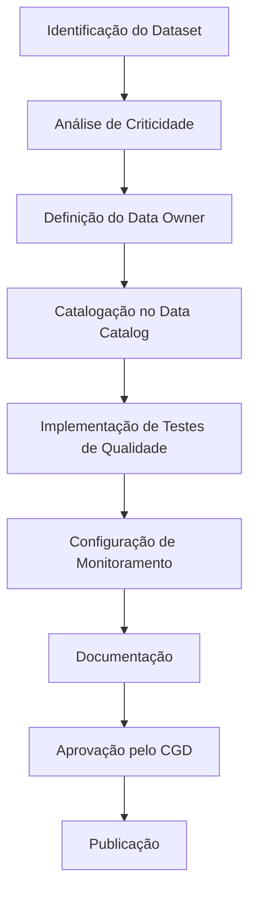

# Governança de Dados - Estrutura e Processos

## Visão Geral

A governança de dados é o framework que garante que os dados sejam gerenciados como um ativo estratégico, com qualidade, segurança e conformidade adequadas. Este documento detalha a estrutura organizacional, processos e práticas recomendadas.

## Estrutura Organizacional

### Conselho de Governança de Dados (CGD)

**Composição**:
- CEO (Sponsor executivo)
- CTO/CDO (Líder técnico)
- CFO (Representante financeiro)
- Head Comercial (Representante de vendas)
- Head Operações (Representante operacional)
- Data Protection Officer (DPO)

**Responsabilidades**:
- Definir estratégia de dados
- Aprovar políticas e padrões
- Resolver conflitos de prioridades
- Monitorar métricas de governança
- Garantir conformidade regulatória

**Reuniões**: Mensais, com revisões trimestrais

### Data Owners (Proprietários de Dados)

**Por Domínio**:
- **Comercial**: Head de Vendas
- **Operacional**: Head de Operações
- **Financeiro**: CFO
- **Marketing**: Head de Marketing
- **Produto**: Head de Produto

**Responsabilidades**:
- Definir requisitos de qualidade
- Validar modelos de dados
- Aprovar mudanças em datasets críticos
- Garantir conformidade com regulamentações
- Resolver questões de acesso e segurança

### Data Stewards (Curadores de Dados)

**Perfil**:
- Conhecimento profundo do domínio
- Experiência com ferramentas de dados
- Habilidades analíticas
- Capacidade de documentação

**Responsabilidades**:
- Catalogar datasets e metadados
- Implementar testes de qualidade
- Monitorar SLAs de dados
- Treinar usuários finais
- Reportar problemas de qualidade

### Data/Analytics Engineers

**Responsabilidades**:
- Desenvolver e manter pipelines ETL
- Implementar testes automatizados
- Configurar monitoramento e alertas
- Otimizar performance de queries
- Manter semantic layer

## Políticas de Governança

### 1. Política de Classificação de Dados

**Níveis de Classificação**:

| Nível | Descrição | Exemplos | Controles |
|-------|-----------|----------|-----------|
| **Público** | Dados que podem ser compartilhados externamente | Informações de produtos, blog posts | Acesso livre |
| **Interno** | Dados para uso interno da empresa | Relatórios de performance, análises | Funcionários autenticados |
| **Confidencial** | Dados sensíveis do negócio | Estratégias, dados financeiros | Acesso baseado em função |
| **Restrito** | Dados pessoais ou regulamentados | CPF, dados bancários, saúde | Aprovação explícita + auditoria |

### 2. Política de Qualidade de Dados

**Dimensões de Qualidade**:

| Dimensão | Definição | Métrica | Meta |
|----------|-----------|---------|------|
| **Completude** | % de campos obrigatórios preenchidos | Campos nulos / Total campos | > 95% |
| **Precisão** | % de valores corretos | Valores válidos / Total valores | > 98% |
| **Consistência** | % de dados consistentes entre sistemas | Registros consistentes / Total | > 99% |
| **Atualidade** | % de dados atualizados no SLA | Dados no SLA / Total | > 95% |
| **Unicidade** | % de registros únicos | Registros únicos / Total | > 99% |

### 3. Política de Retenção de Dados

**Períodos de Retenção**:

| Tipo de Dado | Período | Justificativa |
|--------------|---------|---------------|
| **Dados transacionais** | 7 anos | Conformidade fiscal |
| **Dados de marketing** | 3 anos | Análise de tendências |
| **Logs de aplicação** | 1 ano | Troubleshooting |
| **Dados pessoais** | 2 anos após inatividade | LGPD |
| **Dados de auditoria** | 10 anos | Conformidade regulatória |

### 4. Política de Acesso e Segurança

**Princípios**:
- **Least Privilege**: Acesso mínimo necessário
- **Need to Know**: Acesso baseado em necessidade
- **Segregation of Duties**: Separação de responsabilidades
- **Regular Review**: Revisão periódica de acessos

**Controles de Acesso**:
- Autenticação multi-fator (MFA)
- Single Sign-On (SSO)
- Role-Based Access Control (RBAC)
- Attribute-Based Access Control (ABAC)

## Processos de Governança

### 1. Processo de Onboarding de Novos Datasets



### 2. Processo de Gestão de Mudanças

**Fluxo**:
1. **Solicitação**: Via sistema de tickets
2. **Análise de Impacto**: Linhagem de dados
3. **Aprovação**: Data Owner + CGD
4. **Implementação**: Analytics Engineer
5. **Validação**: Data Steward
6. **Comunicação**: Stakeholders afetados

### 3. Processo de Resolução de Incidentes

**Classificação de Severidade**:
- **Crítica**: Impacto em KPIs executivos
- **Alta**: Impacto em relatórios gerenciais
- **Média**: Impacto em análises específicas
- **Baixa**: Impacto em exploração de dados

**SLA de Resolução**:
- Crítica: 2 horas
- Alta: 8 horas
- Média: 24 horas
- Baixa: 72 horas

### 4. Processo de Auditoria

**Frequência**:
- **Contínua**: Monitoramento automatizado
- **Mensal**: Revisão de acessos
- **Trimestral**: Auditoria de qualidade
- **Anual**: Auditoria completa de conformidade

## Ferramentas de Governança

### 1. Data Catalog

**Ferramenta**: OpenMetadata

**Funcionalidades**:
- Descoberta automática de datasets
- Catalogação de metadados
- Documentação colaborativa
- Linhagem de dados
- Classificação de sensibilidade

**Exemplo de Catalogação**:
```yaml
dataset:
  name: "fct_sales"
  description: "Tabela de fatos de vendas"
  owner: "comercial@empresa.com"
  classification: "Confidencial"
  update_frequency: "Diário"
  quality_score: 98.5
  columns:
    - name: "customer_id"
      type: "INTEGER"
      description: "ID único do cliente"
      is_pii: false
    - name: "sale_amount"
      type: "DECIMAL"
      description: "Valor da venda"
      is_pii: false
```

### 2. Qualidade de Dados

**Ferramenta**: Great Expectations

**Implementação**:
```python
# Expectativas de qualidade para tabela de vendas
import great_expectations as ge

def create_sales_expectations():
    expectations = [
        {
            "expectation_type": "expect_column_values_to_not_be_null",
            "kwargs": {"column": "customer_id"}
        },
        {
            "expectation_type": "expect_column_values_to_be_between",
            "kwargs": {
                "column": "sale_amount",
                "min_value": 0,
                "max_value": 1000000
            }
        },
        {
            "expectation_type": "expect_column_values_to_be_unique",
            "kwargs": {"column": "transaction_id"}
        }
    ]
    return expectations
```

### 3. Linhagem de Dados

**Ferramenta**: OpenLineage

**Configuração**:
```yaml
# Configuração OpenLineage no Airflow
openlineage:
  transport:
    type: http
    url: http://lineage-server:5000
    endpoint: /api/v1/lineage
  
  facets:
    - sql
    - schema
    - dataset_version
    - column_lineage
```

### 4. Monitoramento

**Ferramenta**: Grafana + Prometheus

**Métricas de Governança**:
- Taxa de datasets catalogados
- Score de qualidade médio
- Tempo de resolução de incidentes
- Cobertura de testes de qualidade
- Conformidade com SLAs

## Métricas de Governança

### 1. Métricas de Qualidade

| Métrica | Definição | Cálculo | Meta |
|---------|-----------|---------|------|
| **Data Quality Score** | Score médio de qualidade | (Σ scores individuais) / Total datasets | > 90% |
| **SLA Compliance** | % de datasets dentro do SLA | Datasets no SLA / Total datasets | > 95% |
| **Test Coverage** | % de datasets com testes | Datasets testados / Total datasets | > 90% |
| **Incident Resolution** | Tempo médio de resolução | Σ tempo resolução / Total incidentes | < 4h |

### 2. Métricas de Adoção

| Métrica | Definição | Cálculo | Meta |
|---------|-----------|---------|------|
| **Catalog Adoption** | % de datasets catalogados | Datasets catalogados / Total datasets | > 95% |
| **Self-Service Usage** | % de consultas self-service | Consultas self-service / Total consultas | > 70% |
| **Training Completion** | % de usuários treinados | Usuários treinados / Total usuários | > 80% |
| **Documentation Coverage** | % de datasets documentados | Datasets documentados / Total datasets | > 90% |

### 3. Métricas de Segurança

| Métrica | Definição | Cálculo | Meta |
|---------|-----------|---------|------|
| **Access Review** | % de acessos revisados | Acessos revisados / Total acessos | 100% |
| **Unauthorized Access** | Tentativas de acesso negado | COUNT(tentativas negadas) | < 10/mês |
| **Data Breach** | Incidentes de segurança | COUNT(incidentes) | 0 |
| **Compliance Score** | Score de conformidade | % requisitos atendidos | > 95% |

## Implementação

### Fase 1: Fundação (Semanas 1-4)

**Atividades**:
- Formar CGD e definir papéis
- Implementar data catalog
- Catalogar datasets críticos
- Estabelecer políticas básicas

### Fase 2: Qualidade (Semanas 5-8)

**Atividades**:
- Implementar Great Expectations
- Criar testes de qualidade
- Configurar monitoramento
- Estabelecer SLAs

### Fase 3: Segurança (Semanas 9-12)

**Atividades**:
- Implementar controles de acesso
- Configurar auditoria
- Treinar equipes
- Estabelecer processos

### Fase 4: Otimização (Semanas 13-16)

**Atividades**:
- Otimizar performance
- Automatizar processos
- Expandir coverage
- Medir resultados

## Riscos e Mitigações

### Riscos Identificados

| Risco | Probabilidade | Impacto | Mitigação |
|-------|---------------|---------|-----------|
| **Resistência à mudança** | Alta | Médio | Treinamento e comunicação |
| **Baixa qualidade inicial** | Média | Alto | Limpeza gradual + testes |
| **Sobrecarga de processos** | Média | Médio | Automação + simplificação |
| **Falta de recursos** | Baixa | Alto | Priorização + ROI claro |

### Fatores Críticos de Sucesso

1. **Sponsorship Executivo**: Apoio da alta liderança
2. **Cultura Data-Driven**: Valorização de dados como ativo
3. **Ferramentas Adequadas**: Tecnologia que suporte os processos
4. **Treinamento Contínuo**: Capacitação das equipes
5. **Métricas Claras**: Indicadores de sucesso bem definidos

## Conclusão

A governança de dados é essencial para transformar dados em valor de negócio. A implementação estruturada garante:

- **Qualidade**: Dados confiáveis para tomada de decisão
- **Segurança**: Proteção de informações sensíveis
- **Conformidade**: Atendimento a regulamentações
- **Eficiência**: Processos otimizados e automatizados
- **Escalabilidade**: Capacidade de crescer com a empresa

O sucesso depende do comprometimento organizacional e da execução disciplinada dos processos estabelecidos.
