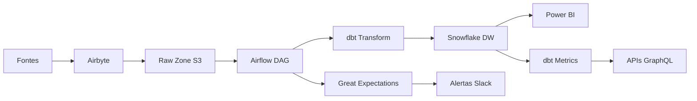

# Plano de Implementação - Automação de Coleta e Visualização

## Visão Geral

Este documento detalha o plano para automatizar a coleta, transformação e visualização dos dados, implementando uma solução end-to-end que suporte os KPIs estratégicos definidos.

## Arquitetura da Solução

### Stack Tecnológico

| Camada | Tecnologia | Justificativa |
|--------|------------|---------------|
| **Orquestração** | Apache Airflow | Padrão de mercado, flexível, open-source |
| **Ingestão** | Airbyte + Debezium | Conectores robustos, CDC em tempo real |
| **Armazenamento** | Snowflake + S3 | Escalabilidade, performance, separação compute/storage |
| **Transformação** | dbt Core | Versionamento, testes, documentação |
| **Qualidade** | Great Expectations | Validação automática, profiling |
| **Semantic Layer** | dbt Metrics | Padronização de KPIs |
| **Visualização** | Power BI | Integração Microsoft, familiaridade |
| **Monitoramento** | Grafana + Prometheus | Observabilidade completa |

### Fluxo de Dados



## Roadmap de Implementação

### Fase 1: Fundação (Semanas 1-4)

#### Semana 1: Setup de Infraestrutura
- [ ] Provisionar cloud resources (AWS/Azure/GCP)
- [ ] Configurar Snowflake warehouse
- [ ] Setup inicial do Airflow
- [ ] Configurar repositório Git e CI/CD

#### Semana 2: Ingestão de Dados
- [ ] Instalar e configurar Airbyte
- [ ] Configurar conectores para:
  - CRM Ploomes
  - ERP SAP B1
  - WhatsApp Business API
  - Plataformas de Ads
- [ ] Testar ingestão inicial

#### Semana 3: Raw Zone e Staging
- [ ] Configurar S3 buckets e estrutura
- [ ] Implementar camada Raw no Snowflake
- [ ] Criar primeiros DAGs do Airflow
- [ ] Configurar dbt project

#### Semana 4: Testes e Validação
- [ ] Implementar testes de conectividade
- [ ] Validar qualidade dos dados ingeridos
- [ ] Documentar processo de ingestão
- [ ] Treinamento básico da equipe

### Fase 2: Transformação e Modelagem (Semanas 5-8)

#### Semana 5: Modelagem Dimensional
- [ ] Desenhar modelo estrela para KPIs
- [ ] Implementar tabelas de dimensão
- [ ] Criar tabelas de fatos
- [ ] Configurar particionamento e clustering

#### Semana 6: Transformações dbt
- [ ] Desenvolver modelos staging
- [ ] Implementar modelos intermediários
- [ ] Criar modelos de mart
- [ ] Configurar testes de qualidade

#### Semana 7: Cálculo de KPIs
- [ ] Implementar lógica de KPIs comerciais
- [ ] Implementar lógica de KPIs operacionais
- [ ] Implementar lógica de KPIs financeiros
- [ ] Criar views materializadas

#### Semana 8: Semantic Layer
- [ ] Configurar dbt Metrics
- [ ] Definir métricas padronizadas
- [ ] Implementar hierarquias dimensionais
- [ ] Testar consistência de cálculos

### Fase 3: Qualidade e Monitoramento (Semanas 9-12)

#### Semana 9: Great Expectations
- [ ] Implementar testes de qualidade
- [ ] Configurar profiling automático
- [ ] Criar expectativas por dataset
- [ ] Integrar com Airflow DAGs

#### Semana 10: Monitoramento
- [ ] Configurar Grafana dashboards
- [ ] Implementar métricas de sistema
- [ ] Configurar alertas automáticos
- [ ] Criar runbooks para incidentes

#### Semana 11: Observabilidade
- [ ] Implementar OpenLineage
- [ ] Configurar rastreamento de linhagem
- [ ] Criar data catalog
- [ ] Documentar datasets

#### Semana 12: Otimização
- [ ] Otimizar queries dbt
- [ ] Ajustar particionamento
- [ ] Implementar cache inteligente
- [ ] Teste de performance

### Fase 4: Visualização e Entrega (Semanas 13-16)

#### Semana 13: Power BI Setup
- [ ] Configurar gateway e conexões
- [ ] Criar datasets semânticos
- [ ] Implementar segurança RLS
- [ ] Configurar refresh automático

#### Semana 14: Dashboards
- [ ] Desenvolver dashboard executivo
- [ ] Criar dashboards operacionais
- [ ] Implementar filtros e drill-downs
- [ ] Testes de usabilidade

#### Semana 15: APIs e Integrações
- [ ] Desenvolver APIs GraphQL
- [ ] Integrar com sistemas internos
- [ ] Configurar webhooks
- [ ] Testes de integração

#### Semana 16: Go-Live
- [ ] Migração para produção
- [ ] Treinamento de usuários
- [ ] Documentação final
- [ ] Suporte pós-implementação

## Configurações Técnicas

### Airflow DAG Example

```python
from datetime import datetime, timedelta
from airflow import DAG
from airflow.operators.bash import BashOperator
from airflow.operators.python import PythonOperator
from airflow_dbt.operators.dbt_operator import DbtRunOperator
from great_expectations_provider.operators.great_expectations import GreatExpectationsOperator

default_args = {
    'owner': 'data-team',
    'depends_on_past': False,
    'start_date': datetime(2025, 1, 1),
    'email_on_failure': True,
    'email_on_retry': False,
    'retries': 2,
    'retry_delay': timedelta(minutes=5),
}

dag = DAG(
    'kpis_pipeline',
    default_args=default_args,
    description='Pipeline principal de KPIs',
    schedule_interval='0 8 * * *',  # Diário às 8h
    catchup=False,
    tags=['kpis', 'production'],
)

# Ingestão de dados
ingest_ploomes = BashOperator(
    task_id='ingest_ploomes',
    bash_command='airbyte sync --connection-id ploomes-connection',
    dag=dag,
)

ingest_sap = BashOperator(
    task_id='ingest_sap',
    bash_command='airbyte sync --connection-id sap-connection',
    dag=dag,
)

# Testes de qualidade
test_raw_data = GreatExpectationsOperator(
    task_id='test_raw_data',
    expectation_suite_name='raw_data_suite',
    batch_kwargs={'table': 'raw_ploomes_leads'},
    dag=dag,
)

# Transformação dbt
transform_data = DbtRunOperator(
    task_id='transform_data',
    dir='/opt/airflow/dbt',
    profiles_dir='/opt/airflow/dbt/profiles',
    target='prod',
    dag=dag,
)

# Testes dbt
test_transformed_data = DbtRunOperator(
    task_id='test_transformed_data',
    dir='/opt/airflow/dbt',
    profiles_dir='/opt/airflow/dbt/profiles',
    target='prod',
    dbt_bin='dbt test',
    dag=dag,
)

# Dependências
[ingest_ploomes, ingest_sap] >> test_raw_data >> transform_data >> test_transformed_data
```

### dbt Model Example

```sql
-- models/marts/commercial/fct_kpis_commercial.sql
{{
  config(
    materialized='table',
    unique_key='date_key',
    cluster_by=['date_key'],
    tags=['kpi', 'commercial']
  )
}}

WITH daily_leads AS (
  SELECT
    date_key,
    COUNT(*) as total_leads,
    COUNT(CASE WHEN status = 'Won' THEN 1 END) as converted_leads,
    SUM(deal_value) as total_revenue
  FROM {{ ref('dim_leads') }}
  WHERE date_key >= CURRENT_DATE - INTERVAL '90 days'
  GROUP BY date_key
),

kpis_calculated AS (
  SELECT
    date_key,
    total_leads,
    converted_leads,
    total_revenue,
    CASE 
      WHEN total_leads > 0 
      THEN (converted_leads::FLOAT / total_leads::FLOAT) * 100 
      ELSE 0 
    END as conversion_rate,
    CASE 
      WHEN converted_leads > 0 
      THEN total_revenue::FLOAT / converted_leads::FLOAT 
      ELSE 0 
    END as avg_deal_value
  FROM daily_leads
)

SELECT
  date_key,
  total_leads,
  converted_leads,
  total_revenue,
  conversion_rate,
  avg_deal_value,
  CURRENT_TIMESTAMP as updated_at
FROM kpis_calculated
```

### Great Expectations Suite

```python
# great_expectations/expectations/kpis_suite.py
import great_expectations as ge

def create_kpis_expectations():
    """
    Criar expectativas para KPIs
    """
    expectations = [
        # Taxa de Conversão
        {
            "expectation_type": "expect_column_values_to_be_between",
            "kwargs": {
                "column": "conversion_rate",
                "min_value": 0,
                "max_value": 100
            }
        },
        # MRR não pode ser negativo
        {
            "expectation_type": "expect_column_values_to_be_between",
            "kwargs": {
                "column": "mrr",
                "min_value": 0,
                "max_value": 10000000
            }
        },
        # SLA WhatsApp
        {
            "expectation_type": "expect_column_values_to_be_between",
            "kwargs": {
                "column": "sla_whatsapp",
                "min_value": 0,
                "max_value": 100
            }
        },
        # Dados não podem ser nulos
        {
            "expectation_type": "expect_column_values_to_not_be_null",
            "kwargs": {
                "column": "date_key"
            }
        }
    ]
    
    return expectations
```

## Ferramentas e Configurações

### 1. Airbyte Configuration

```yaml
# airbyte/connections/ploomes.yml
connection:
  name: "Ploomes CRM"
  source: "source-ploomes"
  destination: "destination-snowflake"
  schedule:
    type: "cron"
    cron_expression: "0 */30 * * * *"  # A cada 30 minutos
  sync_mode: "incremental"
  cursor_field: "updated_at"
  primary_key: ["id"]
```

### 2. Snowflake Setup

```sql
-- Criação do warehouse
CREATE WAREHOUSE IF NOT EXISTS DATA_WAREHOUSE
  WITH WAREHOUSE_SIZE = 'MEDIUM'
  AUTO_SUSPEND = 300
  AUTO_RESUME = TRUE
  INITIALLY_SUSPENDED = TRUE;

-- Criação dos databases
CREATE DATABASE IF NOT EXISTS RAW_DATA;
CREATE DATABASE IF NOT EXISTS ANALYTICS;
CREATE DATABASE IF NOT EXISTS MARTS;

-- Criação dos schemas
CREATE SCHEMA IF NOT EXISTS RAW_DATA.PLOOMES;
CREATE SCHEMA IF NOT EXISTS RAW_DATA.SAP_B1;
CREATE SCHEMA IF NOT EXISTS ANALYTICS.STAGING;
CREATE SCHEMA IF NOT EXISTS MARTS.COMMERCIAL;
```

### 3. Power BI Dataset

```m
// Power Query M para conectar ao Snowflake
let
    Source = Snowflake.Databases("account.snowflakecomputing.com", "MARTS"),
    MARTS_Database = Source{[Name="MARTS"]}[Data],
    COMMERCIAL_Schema = MARTS_Database{[Name="COMMERCIAL"]}[Data],
    fct_kpis_commercial_Table = COMMERCIAL_Schema{[Name="FCT_KPIS_COMMERCIAL"]}[Data]
in
    fct_kpis_commercial_Table
```

### 4. Grafana Dashboard

```json
{
  "dashboard": {
    "title": "Data Pipeline Monitoring",
    "panels": [
      {
        "title": "Pipeline Success Rate",
        "type": "stat",
        "targets": [
          {
            "expr": "sum(rate(airflow_dag_run_success_total[5m])) / sum(rate(airflow_dag_run_total[5m])) * 100",
            "legendFormat": "Success Rate %"
          }
        ]
      },
      {
        "title": "Data Freshness",
        "type": "graph",
        "targets": [
          {
            "expr": "time() - max(data_freshness_timestamp)",
            "legendFormat": "Minutes since last update"
          }
        ]
      }
    ]
  }
}
```

## Monitoramento e Alertas

### 1. SLAs Definidos

| Processo | SLA | Alertas |
|----------|-----|---------|
| Ingestão Ploomes | 30 min | Slack crítico |
| Ingestão SAP B1 | 1 hora | Slack warning |
| Transformação dbt | 2 horas | Email + Slack |
| Refresh Power BI | 30 min | Teams |
| Testes de Qualidade | 15 min | Slack |

### 2. Métricas de Monitoramento

```python
# Prometheus metrics
from prometheus_client import Counter, Histogram, Gauge

# Contadores
pipeline_runs_total = Counter('pipeline_runs_total', 'Total pipeline runs', ['status'])
data_quality_tests_total = Counter('data_quality_tests_total', 'Total quality tests', ['result'])

# Histogramas
pipeline_duration = Histogram('pipeline_duration_seconds', 'Pipeline execution time')
query_duration = Histogram('query_duration_seconds', 'Query execution time', ['query_type'])

# Gauges
data_freshness = Gauge('data_freshness_minutes', 'Minutes since last data update', ['source'])
active_connections = Gauge('active_connections', 'Number of active database connections')
```

### 3. Alertas Configurados

```yaml
# alertmanager/config.yml
route:
  group_by: ['alertname']
  group_wait: 10s
  group_interval: 10s
  repeat_interval: 1h
  receiver: 'web.hook'

receivers:
- name: 'web.hook'
  slack_configs:
  - api_url: 'https://hooks.slack.com/services/...'
    channel: '#data-alerts'
    title: 'Data Pipeline Alert'
    text: 'Alert: {{ range .Alerts }}{{ .Annotations.summary }}{{ end }}'

inhibit_rules:
- source_match:
    severity: 'critical'
  target_match:
    severity: 'warning'
  equal: ['alertname', 'dev', 'instance']
```

## Testes e Validação

### 1. Testes de Integração

```python
# tests/integration/test_pipeline.py
import pytest
from datetime import datetime, timedelta

def test_end_to_end_pipeline():
    """
    Teste completo do pipeline de ponta a ponta
    """
    # 1. Verificar ingestão
    assert check_data_ingestion('ploomes', datetime.now() - timedelta(hours=1))
    
    # 2. Verificar transformação
    assert check_data_transformation('fct_kpis_commercial')
    
    # 3. Verificar qualidade
    assert check_data_quality('kpis_suite')
    
    # 4. Verificar disponibilidade no BI
    assert check_powerbi_refresh('KPIs Dashboard')

def test_kpi_calculations():
    """
    Teste dos cálculos de KPIs
    """
    # Dados de teste
    test_data = {
        'total_leads': 100,
        'converted_leads': 15,
        'total_revenue': 75000
    }
    
    # Cálculos esperados
    expected_conversion = 15.0
    expected_avg_deal = 5000.0
    
    # Validar
    assert calculate_conversion_rate(test_data) == expected_conversion
    assert calculate_avg_deal_value(test_data) == expected_avg_deal
```

### 2. Testes de Performance

```python
# tests/performance/test_performance.py
import pytest
import time

def test_query_performance():
    """
    Teste de performance das queries principais
    """
    queries = [
        'SELECT * FROM marts.commercial.fct_kpis_commercial WHERE date_key >= CURRENT_DATE - 30',
        'SELECT * FROM marts.operational.fct_kpis_operational WHERE date_key >= CURRENT_DATE - 7',
        'SELECT * FROM marts.financial.fct_kpis_financial WHERE date_key >= CURRENT_DATE - 90'
    ]
    
    for query in queries:
        start_time = time.time()
        execute_query(query)
        execution_time = time.time() - start_time
        
        # Queries devem executar em menos de 5 segundos
        assert execution_time < 5.0, f"Query too slow: {execution_time}s"
```

## Gestão de Mudanças

### 1. Processo de Deploy

```bash
#!/bin/bash
# scripts/deploy.sh

# 1. Testes
echo "Running tests..."
pytest tests/ -v

# 2. Validação dbt
echo "Testing dbt models..."
dbt test --profiles-dir ./profiles

# 3. Deploy staging
echo "Deploying to staging..."
dbt run --profiles-dir ./profiles --target staging

# 4. Validação staging
echo "Validating staging..."
great_expectations checkpoint run staging_checkpoint

# 5. Deploy production
echo "Deploying to production..."
dbt run --profiles-dir ./profiles --target prod

# 6. Restart services
echo "Restarting services..."
docker-compose restart airflow-webserver
docker-compose restart airflow-scheduler
```

### 2. Rollback Plan

```bash
#!/bin/bash
# scripts/rollback.sh

# 1. Parar pipelines
echo "Stopping pipelines..."
airflow dags pause kpis_pipeline

# 2. Restaurar backup
echo "Restoring from backup..."
dbt run --profiles-dir ./profiles --target prod --vars '{"backup_date": "2025-01-15"}'

# 3. Validar rollback
echo "Validating rollback..."
great_expectations checkpoint run rollback_checkpoint

# 4. Reiniciar pipelines
echo "Restarting pipelines..."
airflow dags unpause kpis_pipeline
```

## Custos e Recursos

### 1. Estimativa de Custos Mensais

| Recurso | Custo Estimado | Justificativa |
|---------|----------------|---------------|
| Snowflake | $2,000 | Compute + Storage |
| AWS S3 | $200 | Object storage |
| EC2 (Airflow) | $500 | Orquestração |
| Power BI Premium | $5,000 | Licenças usuários |
| Monitoramento | $300 | Grafana Cloud |
| **Total** | **$8,000** | |

### 2. Recursos Humanos

| Papel | Dedicação | Responsabilidades |
|-------|-----------|-------------------|
| Data Engineer | 100% | Desenvolvimento e manutenção |
| Analytics Engineer | 100% | Modelagem e KPIs |
| Data Analyst | 50% | Validação e documentação |
| DevOps | 25% | Infraestrutura e deploy |

## Próximos Passos

### 1. Pré-requisitos
- [ ] Aprovação de orçamento
- [ ] Definição da equipe
- [ ] Acesso aos sistemas fonte
- [ ] Ambiente de desenvolvimento

### 2. Kick-off
- [ ] Reunião de alinhamento
- [ ] Definição de cronograma
- [ ] Setup de ferramentas
- [ ] Primeira sprint

### 3. Acompanhamento
- [ ] Weekly status reports
- [ ] Monthly steering committee
- [ ] Quarterly business review
- [ ] Annual strategic planning

## Conclusão

Este plano de implementação fornece um roadmap detalhado para automatizar a coleta, transformação e visualização de dados, criando uma base sólida para tomada de decisões baseadas em dados. O sucesso depende da execução disciplinada, monitoramento contínuo e adaptação às necessidades do negócio.
